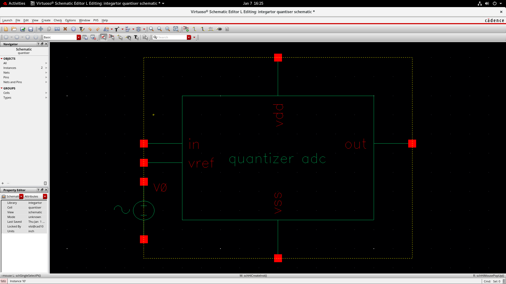
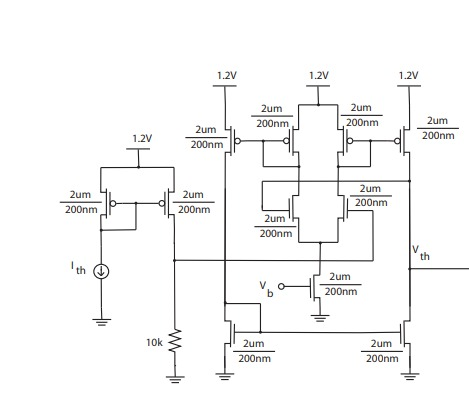

# CMOS Quantiser – Cadence Virtuoso

This repository contains the design and simulation of a **CMOS quantiser**
implemented using **Cadence Virtuoso**. The quantiser converts an analog
signal into a 1-bit digital output and is a key block of a
**Sigma–Delta Modulator**.

## Tool Used
- Cadence Virtuoso (Analog Design Environment)

## Library Name
- quantiser

## Cells Included
- **quantiser** : CMOS quantiser schematic and symbol
- **quantiser_tb** : Quantiser testbench

## Simulations
- Transient analysis
- Input: Analog (sinusoidal / ramp)
- Output: 1-bit digital waveform

## Quantiser Schematic

## Quantiser Symbol

## Optimised Quantiser Symbol

## Reference Circuit
Reference circuit used for designing and validating the quantiser architecture.

## Project Team
- Likhith Gowda H R
- Dhruthi Sridhar
- Adith Soragu
